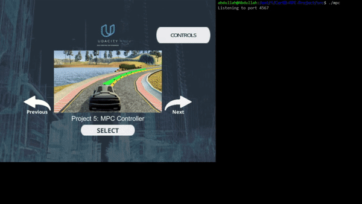

# CarND-Controls-MPC
Self-Driving Car Engineer Nanodegree Program

---


## About the Modle

The simulator returns variables that desribe the state of the car in the simulation, these values are used as input for the MPC. The modle that we used is the one introduced in the class, first we pass it the state that we got from the simulator then, the solver will use the Model, Constraints and Cost functions to produce a vector of controlled inputs that minimizes the cost function.
the state that is used in this model is made up of the X-position, the y-position, the vehicle orientation and the velocity.
The Actuator which is in charge of controling the system is needed for the steering angle and the throtlle and brake pedals.(each has its own actuator)
and Finaly the Update equations x = x + v*cos(ψ)* dt | y = y + v sin(psi) dt | v=v+a∗dt (a at [-1,1]) |ψ=ψ+(v/L_f)*δ∗dt

But before we start we fitted a polynomial to the waypoint, reson is that the simulator gives us coordinates of the car from the map, what we did was use the polynomial to transform these values into the point of view of our car, which makes it easier to then process.

next lets talk a bit about N and dt
Timestep Length and Elapsed Duration 


## N (Timestep Length) and dt (Elapsed Durtion)

After some playing around and watching a very usefull video ( https://youtu.be/bOQuhpz3YfU) we learned that the increase in the value of the timester N means too many calculations that the function has to do and that will slow the process significantly, when it should be happening in real time. And increasing the ELapsed Duration dt will prompt the model to look way into the future and that will lead into confusion while making decisions. Where the video refrenced above suggested to put N = 10 and dt = 0.1 which means that the optimization will be happening one second ahead for every 10 timesteps meaning that the view will be 10 seconds forward.


next comes the latency

## Latency

After some research we found many people doing a 100 ms delay between the calculations and the acuators completing the commands which reaped  the wanted results. But then we have to get the modle to concider this delay, because if it doesn't, the data processed would not represent the current state in the simulation. And for that the state that was passed to the solver is the expected after the 100 ms.


## Result

the final result is shown below 



and in this link https://youtu.be/eoEcrjK-78k


## Dependencies

* cmake >= 3.5
 * All OSes: [click here for installation instructions](https://cmake.org/install/)
* make >= 4.1(mac, linux), 3.81(Windows)
  * Linux: make is installed by default on most Linux distros
  * Mac: [install Xcode command line tools to get make](https://developer.apple.com/xcode/features/)
  * Windows: [Click here for installation instructions](http://gnuwin32.sourceforge.net/packages/make.htm)
* gcc/g++ >= 5.4
  * Linux: gcc / g++ is installed by default on most Linux distros
  * Mac: same deal as make - [install Xcode command line tools]((https://developer.apple.com/xcode/features/)
  * Windows: recommend using [MinGW](http://www.mingw.org/)
* [uWebSockets](https://github.com/uWebSockets/uWebSockets)
  * Run either `install-mac.sh` or `install-ubuntu.sh`.
  * If you install from source, checkout to commit `e94b6e1`, i.e.
    ```
    git clone https://github.com/uWebSockets/uWebSockets
    cd uWebSockets
    git checkout e94b6e1
    ```
    Some function signatures have changed in v0.14.x. See [this PR](https://github.com/udacity/CarND-MPC-Project/pull/3) for more details.

* **Ipopt and CppAD:** Please refer to [this document](https://github.com/udacity/CarND-MPC-Project/blob/master/install_Ipopt_CppAD.md) for installation instructions.
* [Eigen](http://eigen.tuxfamily.org/index.php?title=Main_Page). This is already part of the repo so you shouldn't have to worry about it.
* Simulator. You can download these from the [releases tab](https://github.com/udacity/self-driving-car-sim/releases).
* Not a dependency but read the [DATA.md](./DATA.md) for a description of the data sent back from the simulator.


## Basic Build Instructions

1. Clone this repo.
2. Make a build directory: `mkdir build && cd build`
3. Compile: `cmake .. && make`
4. Run it: `./mpc`.

## Tips

1. It's recommended to test the MPC on basic examples to see if your implementation behaves as desired. One possible example
is the vehicle starting offset of a straight line (reference). If the MPC implementation is correct, after some number of timesteps
(not too many) it should find and track the reference line.
2. The `lake_track_waypoints.csv` file has the waypoints of the lake track. You could use this to fit polynomials and points and see of how well your model tracks curve. NOTE: This file might be not completely in sync with the simulator so your solution should NOT depend on it.
3. For visualization this C++ [matplotlib wrapper](https://github.com/lava/matplotlib-cpp) could be helpful.)
4.  Tips for setting up your environment are available [here](https://classroom.udacity.com/nanodegrees/nd013/parts/40f38239-66b6-46ec-ae68-03afd8a601c8/modules/0949fca6-b379-42af-a919-ee50aa304e6a/lessons/f758c44c-5e40-4e01-93b5-1a82aa4e044f/concepts/23d376c7-0195-4276-bdf0-e02f1f3c665d)
5. **VM Latency:** Some students have reported differences in behavior using VM's ostensibly a result of latency.  Please let us know if issues arise as a result of a VM environment.
